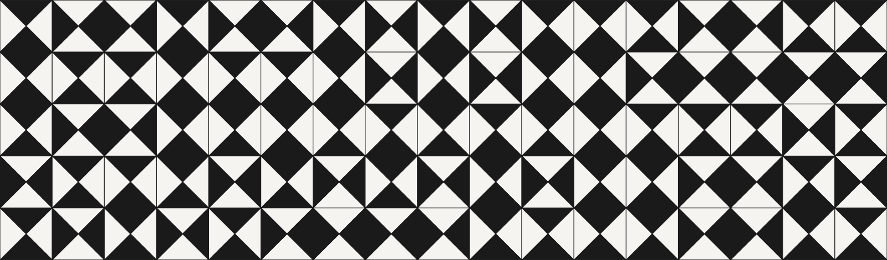

<!-- Replace banner.png below with the generated banner image once it's added to the repo -->

  

# Hi, I'm Joe.K

I build single-file, no-build browser tools exploring generative design, parametric systems, and computational architecture.

📍 New York · 🌐 [axisbim.io](https://axisbim.io/)

---

### Reference systems — Le Corbusier, Mondrian, El Lissitzky

- **[MODULOR MONDRIAN](https://modulor.axisbim.io/)** — parametric facade generator — Le Corbusier x Mondrian
- **[MODULOR MASSING](https://github.com/JoeK212/modular.massing)** — parametric massing studies using Le Corbusier's Modulor
- **[PROUN GENERATOR](https://github.com/JoeK212/proun-generator)** — generative Proun/Mondrian compositions
- **[PARALLAX](https://github.com/JoeK212/PARALLAX)** — generative axonometric compositions, in the spirit of El Lissitzky's Proun plates

### Real-world data, grown back as form

- **[NYC MASSING](https://github.com/JoeK212/NYC.Massing)** — real NYC building massing, grown from actual PLUTO tax lot records and Building Footprints
- **[NYC TREE DATA](https://github.com/JoeK212/NYCTreeDataVisualization)** — NYC's 2015 Street Tree Census, grown back as a procedural forest
- **[AUDIO SPECTROGRAM](https://github.com/JoeK212/audiospectrogram)** — audio → spectrogram → CNC-millable G-code

### Geometry & pattern explorers

- **[SPIRA](https://github.com/JoeK212/SPIRA)** — exploring architectural deformation operations
- **[FIGURE GROUND](https://github.com/JoeK212/figuregroundv1)** — Three.js figure-ground relief explorer
- **[TESSERA TILE PATTERN](https://github.com/JoeK212/tesseratilepattern)** — generative tile pattern engine, square and hex grids
- **[MURMUR](https://github.com/JoeK212/murmur)** — a field of kinetic spheres, inspired by ART+COM's BMW Kinetic Sculpture

### Other experiments

Truth Log (barcode-scan research tool) · JKML Kitchen (recipe/grocery PWA) · Field Notes (shareable notes PWA)
